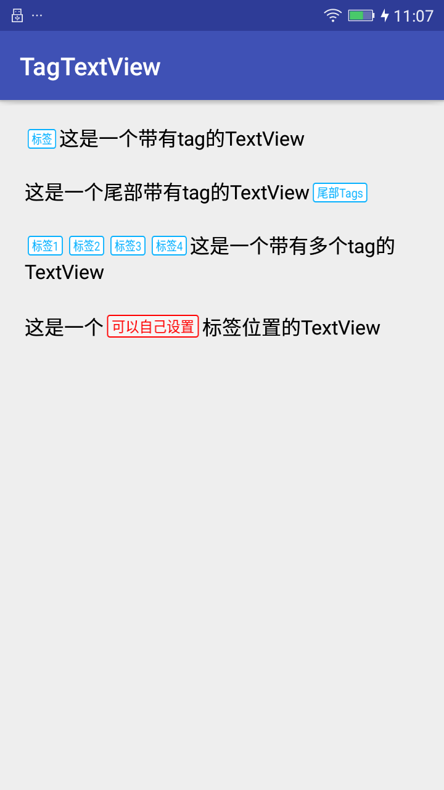

# TagTextView

> TagTextView是一个带标签的TextView，继承自TextView

> TagTextView可以实现在一段文字前显示一个或者多个标签

> TagTextView也可以添加到任意位置(暂未实现，有兴趣可以自己去探索)




# 如何使用TagTextView

> 拷贝项目中的TagTextView.java文件及相关资源文件
```
    [TagTextView.java](app/src/main/java/com/xiaozhiguang/views/TagTextView.java)            // 自定义的TagTextView
    [activity_tag_text_view.xml](app/src/main/res/layout/layout_textview_tags.xml)           // tag的布局文件
    [shape_textview_tags_bg.xml](app/src/main/res/drawable/shape_textview_tags_bg.xml)       // tag的样式文件

```

> 在你的布局中引用自定义view

```
    <com.xiaozhiguang.views.TagTextView
        android:id="@+id/tv_with_tags"
        android:layout_width="wrap_content"
        android:layout_height="wrap_content"
        android:lineSpacingExtra="2dp"
        android:text="这是一个带tag的TextView"
        android:textColor="#000000"
        android:textSize="16sp" />
```

> 在你的Activity中初始化TagTextView
```
    private TagTextView tv_with_tags;
    
    tv_with_tags = findViewById(R.id.tv_with_tags);
```

> 给TagTextView设置标签和内容

```
        //  设置单个标签
        tv_with_tags.setSingleTagAndContent("系列", "这是一个带有tag的TextView");
        
        //  设置多个标签
        List<String> tags = new ArrayList<>();
        tags.add("标签1");
        tags.add("标签2");
        tags.add("标签3");
        tags.add("标签4");
        tv_with_tags.setMultiTagAndContent(tags, "这是一个带有多个tag的TextView");
```
# Tips

> 小提示：使用TagTextView的过程中可能会出现标签与文字不对齐的问题，这里我暂时给出的解决方法是在布局文件中给文本添加一个间距能基本达到要求。